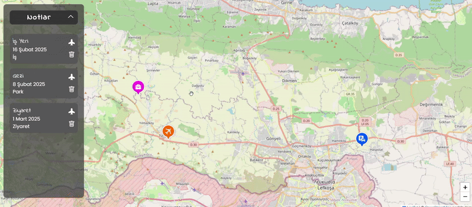

# GeoNotes

Bu proje, Leaflet.js kullanarak interaktif bir harita üzerinde notlar oluşturmanıza, saklamanıza ve yönetmenize olanak tanır. Kullanıcılar, harita üzerinde herhangi bir noktaya tıklayarak not ekleyebilir, notlarını listeleyebilir ve daha sonra kaydedilen notlara kolayca ulaşabilir.

# Proje Özellikleri:

Konum Tespiti: Kullanıcının mevcut konumu tespit edilerek harita başlangıçta o noktaya odaklanır. Eğer konum bilgisi paylaşılamazsa, varsayılan bir konum kullanılır.

Harita Üzerinde Not Ekleme: Haritanın herhangi bir noktasına tıklayarak bir not oluşturulabilir. Notlar başlık, tarih ve durum bilgisi içerir.

Yer İşaretleri (Markerlar): Eklenen her not, harita üzerinde özel ikonlarla gösterilir.

Notları Kaydetme: Notlar, localStorage kullanılarak tarayıcıda saklanır, böylece sayfa yenilendiğinde kaybolmaz.

Notları Silme: Kullanıcılar, ekledikleri notları silebilir.

Notlara Odaklanma: Bir nota tıklanarak harita o noktaya otomatik olarak odaklanır.

Responsive Tasarım: Kullanıcı deneyimini artırmak için duyarlı bir arayüz sunar.

# Kullanılan Teknolojiler:

JavaScript (ES6+): Projenin ana işleyişi için

Leaflet.js: Harita işlemleri için

LocalStorage: Notları tarayıcıda saklamak için

HTML & CSS: Kullanıcı arayüzü için

# Ekran Görüntüsü

